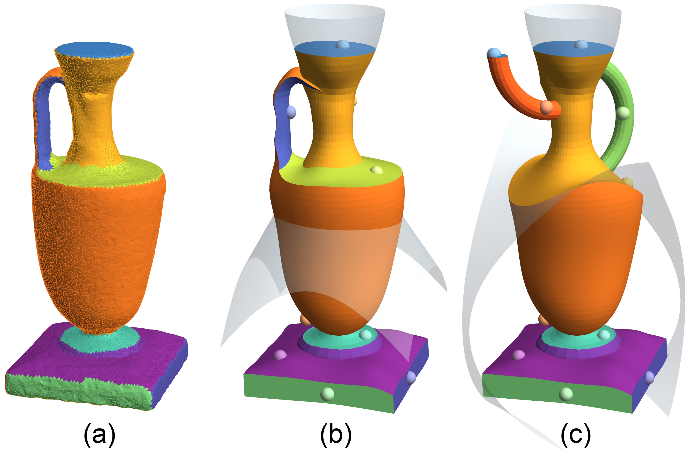

# Boundary-Sampled Halfspaces

[Xingyi Du](https://duxingyi-charles.github.io/), [Qingnan Zhou](https://research.adobe.com/person/qingnan-zhou/),  [Nathan Carr](https://research.adobe.com/person/nathan-carr/), [Tao Ju](https://www.cse.wustl.edu/~taoju/)
 *ACM Transaction on Graphics (Proceedings of SIGGRAPH 2021)* 

[`Project Page`](https://duxingyi-charles.github.io/publication/boundary-sampled-halfspaces/)

## Abstract

We present a novel representation of solid models for shape design. Like Constructive Solid Geometry (CSG), the solid shape is constructed from a set of halfspaces without the need for an explicit boundary structure. Instead of using Boolean expressions as in CSG, the shape is defined by sparsely placed samples on the boundary of each halfspace. This representation, called Boundary-Sampled Halfspaces (BSH), affords greater agility and expressiveness than CSG while simplifying the reverse engineering process. We discuss theoretical properties of the representation and present practical algorithms for boundary extraction and conversion from other representations. Our algorithms are demonstrated on both 2D and 3D examples.

## Code

- BSH_CLI, a command line program that extracts the boundary of the BSH shape defined by a set of halfspaces and sample points. 
- BSH_GUI, a GUI program for interactively solid modeling using our BSH representation.

The programs have been tested on macOS 11.4.

## Build

### Mac

We use [NLopt](https://nlopt.readthedocs.io/en/latest/) (version 2.6.1)'s L-BFGS quasi-Newton implementation.

The easiest way to build on Mac is to run the script, which installs NLopt using [homebrew](https://brew.sh/) and compiles the program.

    ./build_mac.sh

The program `findInjective` will be generated in the `build` subdirectory.

## How to use

The executable `findInjective` asks for 3 arguments: path to an input data file, path to a solver options file, and path to the file to store the result.

    ./findInjective [input_file] [solver_options_file] [result_file]

An example is provided in the `example` subdirectory. Test it by:

    ./findInjective example/input example/solver_options example/my_result

The result will be written to `example/my_result`.

In the 3 arguments, `input_file` is mandatory, while the rest two are optional. If `solver_options_file` is not specified, `findInjective` will look for a file named `solver_options` in the same directory as the binary. If that file is not found, the program will fall back to default options. If `result_file` is not given, results will be written to a file named `result` in the directory of the binary.

## File format

### input_file

_Input file_ contains vertices and faces(triangles/tetrahedrons) information about the source mesh and initial embedding, as well as the indices of constrained vertices (called handles, usually are just boundary vertices). Vertices are indexed from 0.

    [num_sourceVert] [dimension_sourceVert]
    ... (num_sourceVert * dimension_sourceVert) Matrix ...
    [num_initVert]   [dimension_initVert]
    ... (num_initVert * dimension_initVert) Matrix ...
    [num_simplex]    [simplex_size]
    ... (num_simplex * simplex_size) Matrix ...
    [num_handles]
    ... (num_handles * 1) Matrix ...

See `example/input` for a concrete example.

:bell:  **Important**: Since TLC aims at constrained embedding problem, the user should at least provide the indices of boundary vertices as handles in the `input_file`, or provide them in a `handleFile` as described below.
To make this easier, we provide a script to generate a `handleFile` containing boundary vertex indices for a given input mesh. See below for usage.

:tada: **It's possible to use your own mesh formats.** We provide two python scripts in directory `IO` to convert common mesh formats to our `input_file` format.

To use the two scripts, make sure to install [meshio](https://github.com/nschloe/meshio) with

     pip install meshio

To convert triangle meshes to our input format, run

    ./convert_input_2D.py [inputObjFile] [handleFile] [outFile]

Currently, we only support OBJ file with initial mesh as uv coordinates. Check out our [dataset](https://github.com/duxingyi-charles/Locally-Injective-Mappings-Benchmark) for some concrete OBJ and handle files.
The generated `outFile` will have the format of our `input_file`.

For your convenience, we also provide a script in directory `IO` to generate a `handleFile` containing all the boundary vertex indices for a given input mesh. The script works for both triangle/tetrahedron mesh.

     ./extract_boundary_vert.py [inputMeshFile] [outputHandleFile] 

To convert tetrahedron rest(source) and initial meshes to our input format, run

    ./convert_input_3D.py [restFile] [initFile] [handleFile] [outFile]

All tet-mesh formats supported by `meshio` should be handled by this script. We have tested the VTK format. For more examples in VTK format, please check out our [dataset](https://github.com/duxingyi-charles/Locally-Injective-Mappings-Benchmark).

### solver_options_file

_Solver options file_ contains parameters for TLC energy, options for NLopt solver, and a list of intermediate status to record during optimization.

    form
    [harmonic OR Tutte]
    alphaRatio
    [val]
    alpha
    [val]
    ftol_abs
    [val]
    ftol_rel
    [val]
    xtol_abs
    [val]
    xtol_rel
    [val]
    algorithm
    [LBFGS]
    maxeval
    [val]
    stopCode
    [none OR all_good]
    record
    vert    [0 OR 1]
    energy  [0 OR 1]
    minArea [0 OR 1]

The following table explains each option in details.
We **recommend** using the default values (especially "form", "alphaRatio" and "alpha") as they are most successful in our experiments.

See `example\solver_options` for a concrete example.

|                | possible values  | default value | explanation                                                                                                                    |
|----------------|------------------|---------------|--------------------------------------------------------------------------------------------------------------------------------|
| form           | harmonic, Tutte  | Tutte         | two forms of TLC energy (see paper for details)                                                                                |
| alphaRatio     | [0, inf)         | 1e-6          | Specify the ratio of content (area or volume) between rest mesh and target domain. Default value 1e-6 is recommended.          |
| alpha          | (-inf, inf)      | -1            | If negative, alpha will be computed from alphaRatio. If non-negative, alpha will overwrite the value computed from alphaRatio. |
| ftol_abs       | (-inf, inf)      | 1e-8          | Absolute energy change stop threshold. Negative value means disabled.                                                          |
| ftol_rel       | (-inf, inf)      | 1e-8          | Relative energy change stop threshold. Negative value means disabled.                                                          |
| xtol_abs       | (-inf, inf)      | 1e-8          | Absolute variable change stop threshold. Negative value means disabled.                                                        |
| xtol_rel       | (-inf, inf)      | 1e-8          | Relative variable change stop threshold. Negative value means disabled.                                                        |
| algorithm      | LBFGS            | LBFGS         | Quasi-Newton method.                                                                                                           |
| maxeval        | positive integer | 10000         | max number of iterations stop threshold.                                                                                        |
| stopCode       | none, all_good   | all_good      | Custom stop criteria. "all_good": optimization will stop when there are no inverted elements.                                   |
| record:vert    | 0, 1             | 0             | 1: record target mesh vertices at each iteration.                                                                              |
| record:energy  | 0, 1             | 0             | 1: record TLC energy at each iteration.                                                                                        |
| record:minArea | 0, 1             | 0             | 1: record smallest simplex signed content (area or volume) at each iteration.                                                  |

### result_file

_Result file_ stores the vertices of result mesh, and also intermediate records as specified in solver options file.

    name dims
    data
    ...

See `example\result` for a concrete example.

We provide a script to convert a `result_file` to a mesh file in directory `IO`.

Usage

    ./get_result_mesh.py [inputFile] [resultFile] [outFile]

For example,

    ./get_result_mesh.py example/input example/result result.vtk

## Examples

Examples under /example directory are used to generate the corresponding figures in the BSH paper.